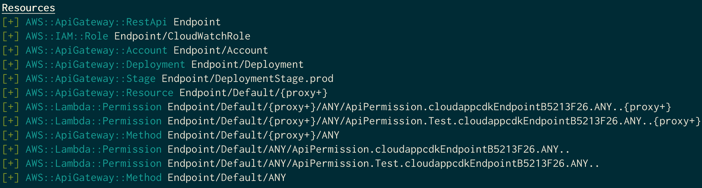

# What is this repo?

This repo is the code base used for the talk '*Live Coding Cloud Apps with CDK (infrastructure as code)*'.

Also, includes documentation that guide you through the process of the live
coding session setp by step to reach the finnal result.

The result of this live coding session can be find at the '*/cloud-app-cdk/*'
directory.

# Thank you to...
It is inspired by [cdkworkshop.com](https://cdkworkshop.com/),
[@darkosubotica](https://twitter.com/darkosubotica) talks,
[cdkday.com](https://www.cdkday.com/) and [awsome-cdk](https://github.com/kolomied/awesome-cdk) repository. I would like to thank all of them which provided a lot
of resources that allowed me to learn about CDK.

# Let's get started!
This document is intended to guide you in the process of building your first
cloud application with CDK so it is divided in a few phases where you will learn
the basic stuff for the next phase, this is better do no try to hurry up and
avoid a phase you could regret it in the following ones.

Note: it is important to know that the whole process needs environment variables
with AWS credentials.

## Init app && prepare virtualenv
```sh
$ mkdir cloud-app-cdk
$ cd cloud-app-cdk
$ cdk init --language python       <--- it will init a CDK boilerplate code
$ source .venv/bin/activate
$ pip install -r requirements.txt
```
## CDK app structure
```
README.md
app.py            <--- entry point
cdk.json          <--- instructionns for cdk toolkit
cloud_app_cdk     <--- cloud application code
requirements.txt
setup.py
source.bat
```
# (Phase 0): Bootstraping your AWS account
You need some AWS resources that will be used by the CDK toolkit to deploy your
app.
```
$ cdk bootstrap
```
This will create a new AWS CloudFormation stack in your AWS account. It is only
necessary to be run one time.

# (Phase 1) Let's deploy something
At this point you will learn how to deploy something into your AWS account,
let's start with a lambda function that will be useful in further phases.

In order to be able to do it you need to install the AWS Lambda construct
library which will allow you to use the lambda construct in your CDK code.
## Lambda construct library
In order to use lambda you need to install the lambda construct library which
will provide AWS Lambda resources.
```sh
$ pip install aws-cdk.aws-lambda
```

Just put your lambda code as follow in the CDK app root directory.
```sh
$ mkdir lambda
$ vim lambda/hello.py
```

For learning purposes it is enough with a 'Hello World!' lambda like this:
```python
import json


def handler(event, context):
    print('request: {}'.format(json.dumps(event)))
    return {
        'statusCode': 200,
        'headers': {
            'Content-Type': 'text/plain'
        },
        'body': 'Hello, CDK! You have hit {}\n'.format(event['path'])
    }
```

## New lambda resource
Now you are ready to create a new resource using the AWS Lambda construct
library. Just edit the '*cloud_app_cdk/cloud_app_cdk_stack.py*' file.

Import the AWS Lambda python module:
```python
from aws_cdk import aws_lambda as _lambda
```
Create a new AWS Lambda resource like this:
```python
class CloudAppCdkStack(core.Stack):

    def __init__(self, scope: core.Construct, id: str, **kwargs) -> None:
        super().__init__(scope, id, **kwargs)

        # Hello lambda resource
        hello_lambda = _lambda.Function(
            self, 'HelloHandler',
            runtime=_lambda.Runtime.PYTHON_3_8,
            code=_lambda.Code.asset('lambda'),
            handler='hello.handler'
        )
```
## Deploy
Now it's time to deploy your CDK application for the first time.
```sh
$ cdk deploy cloud-app-cdk
```
You can check you AWS account at CloudFormation service and you will notice
a new CloudFormation stack is created.

# (Phase 2) API Gateway
A typical resource necessary in cloud application is an API, this resource
usually requires a lot of lines of code when you are coding AWS CloudFormation,
however let's see how it looks in CDK.
## Install API Gateway construct library
Again, you need to install the python package that contains the AWS APIGateway
construct library. It is always you need to do when using a construct library.
```sh
$ pip install aws-cdk.aws_apigateway
```
## Add API Gateway resource
```python
from aws_cdk import aws_apigateway as apigw
..
..
        # Hello lambda resource
        ..
        ..

        # API Gateway
        apigw.LambdaRestApi(
            self, 'Endpoint',
            handler=hello_lambda,
        )
```
## Diff
Before trying to deploy again the changes let's see what is different between
the local cdk application and the one deployed.
```sh
$ cdk diff cloud-app-cdk
```
## Deploy
It looks good and obviously new resources are going to be deployed as shown in
the '*cdk diff*' before.
```sh
$ cdk deploy cloud-app-cdk
```

As you see it will add twelve new resources.

## Test
```
Outputs:
cloud-app-cdk.Endpoint8024A810 = https://jmedoa58w2.execute-api.eu-west-1.amazonaws.com/pro

$ curl https://jmedoa58w2.execute-api.eu-west-1.amazonaws.com/prod/
Hello, CDK! You have hit /
```

# (Phase 3) Writer & reader Lambda
# (Phase 4) DynamoDB
# (Phase 5) Permissions
# (Phase 6) Test your app
## Synth your first CDK application
```sh
cdk synth
```